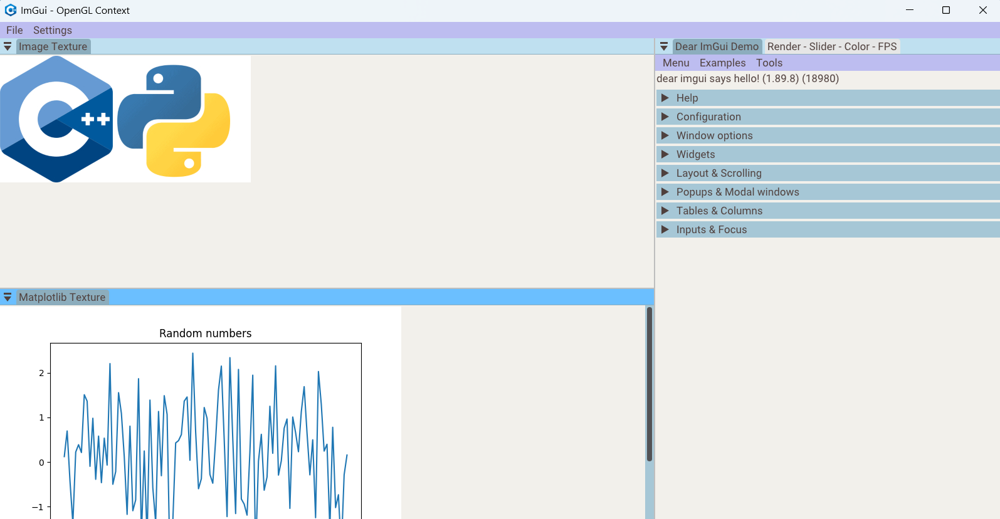

<h1 align="center"">ImGui Template - CMake - C++ Modules</h1>

<p align="center">
  
  
  
  
</p>

---

This project is a simple template to create desktop GUI applications with ImGui and OpenGL, with interoperability with Python through the pybind library. The template uses CMake as the build system, is based on traditional C++ header files (instead of C++20 modules), and supports both Windows and Linux systems.

---

- [1. Requirements](#1-requirements)
- [2. Getting started](#2-getting-started)
- [3. Build](#3-build)
- [4. Use Wayland for window creation](#4-use-wayland-for-window-creation-linux)
- [5. Additional characteristics](#5-additional-characteristics)
- [6. Utils](#6-utils)

## 1. Requirements

- [CMake](https://cmake.org/) (minimum version 3.28)
- Python interpreter (3.10+)
- [Miniconda](https://docs.conda.io/en/latest/miniconda.html)
- Visual Studio 2022 or LLVM/Clang 17 (or newer)
- The template uses the [Roboto](https://fonts.google.com/specimen/Roboto) font ([Apache License, Version 2.0](https://www.apache.org/licenses/LICENSE-2.0))

## 2. Getting started

Install LLVM/Clang in Linux Systems. If you want to use the C++17 standard, in the main `CMakeLists.txt`, you must change the CXX standard (project is set to C++20). Also, you can use the `gcc` compiler for the project for the C++17 standard.

```bash
wget https://apt.llvm.org/llvm.sh
chmod +x llvm.sh
sudo ./llvm.sh <version number> all

# Set Clang version as the default compiler
sudo update-alternatives --install /usr/bin/clang++ clang++ /usr/bin/clang++-16 100
sudo update-alternatives --install /usr/bin/clang clang /usr/bin/clang-16 100
```

Once miniconda is installed, create a new environment and install the required Python packages:

```bash
# Python environment version must be equal to miniconda python version (conda activate base --> python --version)
conda create --name env_name python=3.10
conda activate env_name

# Install required packages
pip install numpy
pip install matplotlib

# You can also use a requirements.txt file to install specific packages version
pip install -r requirements.txt

# For build stage is required enter the path to the python environment.
# Verify Miniconda installation folder and the python environment will as a folder in the folder envs. Here and example:
/home/computer/miniconda3/envs/env_name/

# You can verify environment folder with the following command
conda env list
```

## 3. Build

> [!IMPORTANT]
> This template now uses GLAD2. Key changes:
>
> - GLAD sources are automatically generated during the CMake build
> - Python 3.10+ with Jinja2 is required at configure/build time
> - A new CMake variable PYTHON_PATH can be defined to specify the Python environment path
>   - If not provided, CMake will try to auto-detect one
>   - If the environment does not have jinja2 installed, CMake will show a warning message and indicate the steps to fix it
>   - If a conda environment is active, CMake will automatically use its Python interpreter during configuration

Clone the repository, configure the project and build the app:

```bash
# Compile the app (Linux systems)
git clone --branch header_based https://github.com/fabianperdomolaguna/Imgui_Template_Cmake_CppModules.git
cd Imgui_Template_Cmake_CppModules
# You can omit -GNinja to use the make build. Also, you can omit clang instructions to use another compiler.
CXX=clang++ CC=clang cmake -GNinja -B build -DPYTHON_PATH=/path/to/python_environment
cmake --build build

# In Windows systems, configure the project with the following command.
cmake -B build -DPYTHON_PATH=/path/to/python_environment

# Run the app
cd build/bin
./example
```

In Linux, if you get a similar error to `libGL error: MESA-LOADER: failed to open crocus`, this is a Conda issue related to the pyinstaller and old libstdc++ library. To solve this remove libstdc++ from python environment folder:

```bash
# Go to Python environment folder
cd lib
rm libstdc++.so*
```

## 4. Use Wayland for window creation (Linux)

On Linux, you can create windows using either X11 or Wayland with GLFW (X11 is the default). To use Wayland, you need to have an active Wayland session, and you must apply the following commands and modifications to your CMake files.

```bash
# In the submodules/glfw/CMakeLists.txt file
# add the following lines just before FetchContent_MakeAvailable(glfw)
set(GLFW_BUILD_X11 OFF CACHE BOOL "" FORCE)
set(GLFW_USE_WAYLAND ON CACHE BOOL "" FORCE)
set(GLFW_BUILD_WAYLAND ON CACHE BOOL "" FORCE)

# Install the following dependencies
sudo apt install extra-cmake-modules
sudo apt install libwayland-dev libxkbcommon-dev xorg-dev
sudo apt install wayland-protocols

# Verify you have a Wayland active session (should appear Wayland)
echo $XDG_SESSION_TYPE
```

## 5. Additional characteristics

## Custom Title Bar Layer

This template supports a custom title bar, implemented as a separate ImGui Layer. This allows full control over its appearance, the addition of custom buttons, and manual window dragging. The custom title bar is managed just like any other Layer in the application.

To enable it, set `custom_title_bar` to `true` during Application initialization. When enabled, the template automatically calls `glfwWindowHint(GLFW_DECORATED, GLFW_FALSE);`. This disables the operating system title bar, giving your custom layer full control over the window header.

Features of the custom title bar include:

- Customizable background color depending on the style (Light / Dark)
- Minimize, Maximize / Restore, and Close buttons
- Optional rounded corners on specific buttons
- Centered title text
- Integrates with the application's ImGui layer system

## Windows system icon and Linux launcher

Added a method to set a custom window icon in the Application class. This uses glfwSetWindowIcon to apply a custom icon to the application window.

```cpp
# Use in app settings in main function
# To load from file
app->SetWindowIcon("icon_image_path")

# To load from memory using a header
app->SetWindowIcon(g_icon_app, g_icon_app_len);
```

An .ico file is embedded in the executable via a .rc file, which ensures the .exe displays the custom icon in File Explorer and the icon appears in the Windows Taskbar.

```cpp
# .rc file content
IDI_ICON1 ICON "app.ico"

# .rc file project inclusion using CMake
if (WIN32)
  target_sources(example PRIVATE rc_file_path)
endif()
```

The .ico was created using GIMP with the following steps:

\- Scale your image to 16x16, 32x32, 64x64, 128x128 and 256x256 pixels, using the tool Image Menu > Scale Image  
\- Export each image to .png (e.g. icon_16.png) in File Menu > Export As  
\- Load all images using the Open as Layers option in the File Menu  
\- Export your project layers in File Menu > Export As using the extension Microsoft Windows icon (.ico)

Additionally, the creation of a Linux application launcher with an assigned icon and taskbar integration is described below:

\- Install MenuLibre in your system using the App Center or with the following command `sudo apt install menulibre`  
\- Add the path to the `/bin` directory to your `.profile` file to make the launcher accessible system-wide. The .profile file is located in the home folder and the path is added with the following line `export PATH="/path/folder/bin:$PATH"`  
\- Open MenuLibre -> Add a New Launcher -> Replace the name with your application's name -> Insert the executable name in the Command section -> Select the file to use as the logo associated with the launcher  
\- If the application icon doesn't appear correctly in the taskbar when launched, you need to add `StartupWMClass=WM_Class` to the .desktop file located in `/home/.local/share/applications/menulibre-launchername.desktop`  
\- To get the WM Class of an application, first open the app, then run the command `xprop | grep WM_CLASS` in a terminal. When prompted, click inside the application's window. The terminal will output something like WM_CLASS(STRING) = "example-class", "example-class", which you can use as the value for StartupWMClass in the `.desktop` file.

## 6. Utils

\- Python script for embedding images into memory headers (.h) and restoring them.

<h1 align="center">
  
</h1>
<center>Basic application in the template</center>
