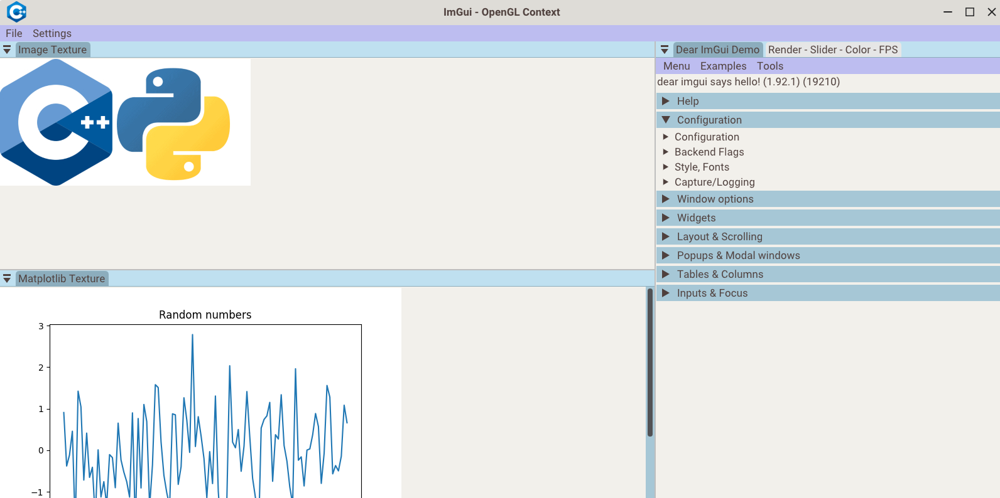

<h1 align="center"">ImGui Template - CMake - C++ Modules</h1>

<p align="center">
  
  
  
  _3.10-FFFF00?style=for-the-badge&logo=Python&logoColor=white" alt="alt text">
</p>

---

This project is a simple template to create desktop GUI applications with ImGui and OpenGL, with interoperability with Python through the pybind library. The template uses CMake as the build system, is based on traditional C++ header files (instead of C++20 modules), and supports both Windows and Linux systems.

---

- [1. Requirements](#1-requirements)
- [2. Getting started](#2-getting-started)
- [3. Build](#3-build)
- [4. Use Wayland for window creation](#4-use-wayland-for-window-creation-linux)
- [5. Python integration — PythonManager](#5-python-integration--pythonmanager)
- [6. Core framework - beryl library](#6-core-framework---beryl-library)
- [7. Additional Characteristics](#7-additional-characteristics)
- [8. Utils](#8-utils)

## 1. Requirements

- [CMake](https://cmake.org/): 3.28+
- Python interpreter: 3.10+ (Intepreter binding & GLAD generation)
- C++ compiler: Visual Studio 2022 (MSVC 19.34+) or LLVM/Clang 19+
- Dependencies: [Python](https://www.python.org/) and [uv](https://github.com/astral-sh/uv) for manage dependencies and environments
- The template uses the [Roboto](https://fonts.google.com/specimen/Roboto) and [PublicSans](https://fonts.google.com/specimen/Public+Sans) font

## 2. Getting started

```bash
wget https://apt.llvm.org/llvm.sh
chmod +x llvm.sh
sudo ./llvm.sh <version number> all

# Set Clang version as the default compiler
sudo update-alternatives --install /usr/bin/clang++ clang++ /usr/bin/clang++-19 100
sudo update-alternatives --install /usr/bin/clang clang /usr/bin/clang-19 100
```

CMake automatically creates a Python virtual environment (`/bin/.venv`) using `uv` and installs all required Python dependencies from `requirements/python/requirements.txt`

## 3. Build

> [!IMPORTANT]
> This template now uses GLAD2. Key changes:
>
> - GLAD sources are automatically generated during the CMake build
> - .venv created by CMake install Jinja2 which is required at configure/build time. This environment is used in runtime for Pybind11

The repository employs CMakePresets workflows to standardize project configuration and build. Clone the repository, configure and build the app:

```bash
git clone https://github.com/fabianperdomolaguna/Imgui_Template_Cmake_CppModules.git

git switch header_based

cd Imgui_Template_Cmake_CppModules

# Select required preset (OS-build_type)
cmake --workflow --preset linux-release

# In Windows systems for example
cmake --workflow --preset windows-debug

# Run the app
cd build/x64-linux-clang-release/bin
./App
```

## 4. Use Wayland for window creation (Linux)

On Linux, you can create windows using either X11 or Wayland with GLFW (X11 is the default). To use Wayland, you need to have an active Wayland session, and you must apply the following commands and modifications to your CMake files.

```bash
# In the submodules/glfw/CMakeLists.txt file
# add the following lines just before FetchContent_MakeAvailable(glfw)
set(GLFW_BUILD_X11 OFF CACHE BOOL "" FORCE)
set(GLFW_BUILD_WAYLAND ON CACHE BOOL "" FORCE)

# Install the following dependencies
sudo apt install extra-cmake-modules
sudo apt install libwayland-dev libxkbcommon-dev xorg-dev
sudo apt install wayland-protocols

# Verify you have a Wayland active session (should appear Wayland)
echo $XDG_SESSION_TYPE
```

## 5. Python integration — PythonManager

This project centralizes the embedded Python interpreter with a `Manager` class located at the `src/app/python/manager.cpp`. The class encapsulates the interpreter call and exposes a simple methods for scripts integration.

- Call `app::python::Manager::Instance();` and  `app::python::PyMgr.Configure(venv_path)` before any Python code runs.
- Use `app::python::PyMgr.BeginSession()` to active Python intepreter.
- `app::python::PyMgrAddSystemPath` method inserts the path at the front of `sys.path` to import local scripts
- `app::python::PyMgr.ImportModule` load a module (from the environment or a local script). Returns an empty module on failure.
- `app::python::PyMgr.SafeCall` returns an empty `py::object` on failure and logs the error so Python script faults do not crash the app, allowing callers to handle fallbacks or retry later.

To remove Python support from the app not instantiate `Manager` class, remove the `pybind11::embed` target from `CMakeLists.txt`, and remove any Python-specific imports from your modules.

## 6. Core framework - beryl library

The project is built upon the beryl internal library, which organizes the core logic and rendering systems into distinct namespaces using C++20 Modules. This ensures a clean separation of concerns and high-performance compilation.

To extend the application, you typically inherit from `beryl::core::Layer`.

```cpp
import beryl.core;
import beryl.renderer;

class MyLayer : public beryl::core::Layer {
  std::unique_ptr<beryl::renderer::Shader> m_Shader;
  
  MyLayer() : Layer("MyLayerName") {}

  void OnAttach() override {
    m_Shader = std::make_unique<beryl::renderer::Shader>();
        // ...
  }
};
```

## 7. Additional characteristics

## Logging

This project uses spdlog for application logging, including an ImGui sink and additional JSON file sink that forwards log messages to an in-app logging console and a JSON line file. The sinks is implemented using asynchronous mode in `src/beryl/logging/logger.cpp` and is registered `beryl::logger::Init()`.

You can open the logging console from the application menu: `Tools -> Logging Console`. The console shows runtime logs inside the GUI and following defined configuration and log lgevels. The `logs.json` file is stored in bin folder.

Quick usage

- Call the initializer `beryl::logger::Init()`
- Open the console with `Tools -> Logging Console` menu to view logs in the GUI
- Import Logger and employes defined static methods of the class `beryl::logger::Trace`, `beryl::logger::Info`, `beryl::logger::Warn`, `beryl::logger::Error`, and `beryl::;ogger::Critical`. They receive a message and key/value pairs separated by commas

## Custom Title Bar Layer

This template supports a custom title bar, implemented as a separate ImGui Layer. This allows full control over its appearance, the addition of custom buttons, and manual window dragging. The custom title bar is managed just like any other Layer in the application.

To enable it, set `custom_title_bar` to `true` during Application initialization. When enabled, the template automatically calls `glfwWindowHint(GLFW_DECORATED, GLFW_FALSE);`. This disables the operating system title bar, giving your custom layer full control over the window header.

Features of the custom title bar include:

- Customizable background color depending on the style (Light / Dark)
- Minimize, Maximize / Restore, and Close buttons
- Optional rounded corners on specific buttons
- Centered title text
- Integrates with the application's ImGui layer system

## Windows system icon and Linux launcher

Added a method to set a custom window icon in the Application class. This uses glfwSetWindowIcon to apply a custom icon to the application window.

```cpp
# Use in app settings in main function
# To load from file
app->SetWindowIcon("icon_image_path")

# To load from memory using a header
app->SetWindowIcon(g_icon_app, g_icon_app_len);
```

An .ico file is embedded in the executable via a .rc file, which ensures the .exe displays the custom icon in File Explorer and the icon appears in the Windows Taskbar.

```cpp
# .rc file content
IDI_ICON1 ICON "app.ico"

# .rc file project inclusion using CMake
if (WIN32)
  target_sources(example PRIVATE rc_file_path)
endif()
```

The .ico was created using GIMP with the following steps:

\- Scale your image to 16x16, 32x32, 64x64, 128x128 and 256x256 pixels, using the tool Image Menu > Scale Image  
\- Export each image to .png (e.g. icon_16.png) in File Menu > Export As  
\- Load all images using the Open as Layers option in the File Menu  
\- Export your project layers in File Menu > Export As using the extension Microsoft Windows icon (.ico)

Additionally, the creation of a Linux application launcher with an assigned icon and taskbar integration is described below:

\- Install MenuLibre in your system using the App Center or with the following command `sudo apt install menulibre`  
\- Add the path to the `/bin` directory to your `.profile` file to make the launcher accessible system-wide. The .profile file is located in the home folder and the path is added with the following line `export PATH="/path/folder/bin:$PATH"`  
\- Open MenuLibre -> Add a New Launcher -> Replace the name with your application's name -> Insert the executable name in the Command section -> Select the file to use as the logo associated with the launcher  
\- If the application icon doesn't appear correctly in the taskbar when launched, you need to add `StartupWMClass=WM_Class` to the .desktop file located in `/home/.local/share/applications/menulibre-launchername.desktop`  
\- To get the WM Class of an application, first open the app, then run the command `xprop | grep WM_CLASS` in a terminal. When prompted, click inside the application's window. The terminal will output something like WM_CLASS(STRING) = "example-class", "example-class", which you can use as the value for StartupWMClass in the `.desktop` file.

## 8. Utils

\- Python script for embedding images into memory headers (.h) and restoring them.

<h1 align="center">
  
</h1>
<center>Basic application in the template</center>
