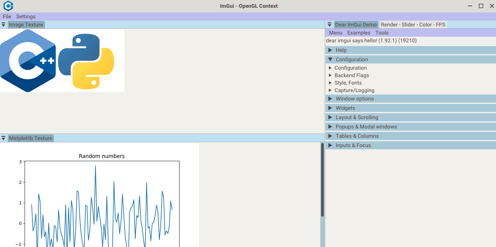

<h1 align="center"">ImGui Template - CMake - C++ Modules</h1>

<p align="center">
  
  
  
  
</p>

---

This project is a simple template to make desktop GUI apps with ImGui to be used with OpenGL, adding interoperability with Python using the pybind library. The template employs CMake as the build system, C++ modules, and supports Windows and Linux systems.

---

- [1. Requirements](#1-requirements)
- [2. Getting started](#2-getting-started)
- [3. Build](#3-build)
- [4. Use Wayland for window creation](#4-use-wayland-for-window-creation-linux)

## 1. Requirements
                      
- [CMake](https://cmake.org/) (minimum version 3.28)
- [Miniconda](https://docs.conda.io/en/latest/miniconda.html)
- Visual Studio 2022 or LLVM/Clang 17 (or newer)
- The template uses the [Roboto](https://fonts.google.com/specimen/Roboto) font ([Apache License, Version 2.0](https://www.apache.org/licenses/LICENSE-2.0))

## 2. Getting started

Install LLVM/Clang in Linux Systems

```bash
wget https://apt.llvm.org/llvm.sh
chmod +x llvm.sh
sudo ./llvm.sh <version number> all

# Set Clang version as the default compiler
sudo update-alternatives --install /usr/bin/clang++ clang++ /usr/bin/clang++-16 100
sudo update-alternatives --install /usr/bin/clang clang /usr/bin/clang-16 100                     
```

Once miniconda is installed, create a new environment and install the required Python packages:

```bash
# Python environment version must be equal to miniconda python version (conda activate base --> python --version)
conda create --name env_name python=3.10
conda activate env_name

# Install required packages
pip install numpy
pip install matplotlib
            
# You can also use a requirements.txt file to install specific packages version
pip install -r requirements.txt
    
# For build stage is required enter the path to the python environment. 
# Verify Miniconda installation folder and the python environment will as a folder in the folder envs. Here and example:
/home/computer/miniconda3/envs/env_name/

# You can verify environment folder with the following command
conda env list                        
```

## 3. Build

Clone the repository, configure the project and build the app:

```bash
# Compile the app (Linux systems)
git clone https://github.com/fabianperdomolaguna/Imgui_Template_Cmake_CppModules.git
cd Imgui_Template_Cmake_CppModules
CXX=clang++ CC=clang cmake -GNinja -B build -DPYTHON_PATH=/path/to/python_environment
cmake --build build

# In Windows systems configure project with the following command. 
cmake -B build -DPYTHON_PATH=/path/to/python_environment
                     
# Run the app
cd build/bin
./example            
```

In Linux if you get a similar error to `libGL error: MESA-LOADER: failed to open crocus`, this is a Conda issue related to the pyinstaller and old libstdc++ library. To solve this remove libstdc++ from python environment folder:

```bash
# Go to Python environment folder
cd lib
rm libstdc++.so*
```
## 4. Use Wayland for window creation (Linux)

On Linux, you can create windows using either X11 or Wayland with GLFW (X11 is the default). To use Wayland, you need to have an active Wayland session, and you must apply the following commands and modifications to your CMake files.

```bash
# In the submodules/glfw/CMakeLists.txt file
# add the following lines just before FetchContent_MakeAvailable(glfw)
set(GLFW_BUILD_X11 OFF CACHE BOOL "" FORCE)
set(GLFW_USE_WAYLAND ON CACHE BOOL "" FORCE)
set(GLFW_BUILD_WAYLAND ON CACHE BOOL "" FORCE)

# Install the following dependencies
sudo apt install extra-cmake-modules
sudo apt install libwayland-dev libxkbcommon-dev xorg-dev
sudo apt install wayland-protocols

# Verify you have a Wayland active session (should appear Wayland)
echo $XDG_SESSION_TYPE
```

<h1 align="center">
  
</h1>
<center>Basic application in the template</center>
